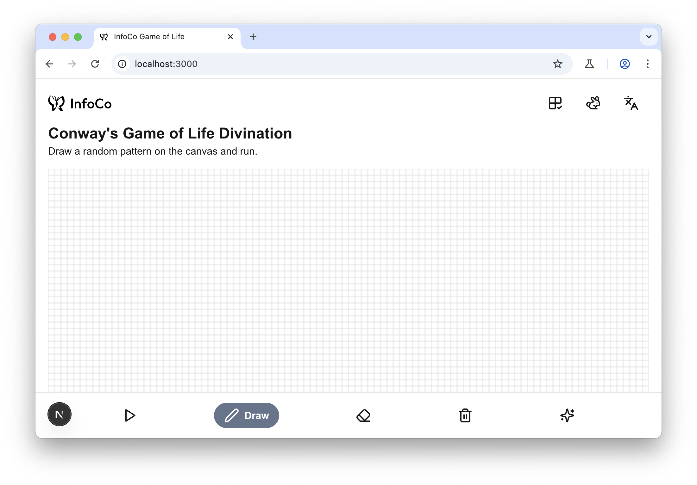
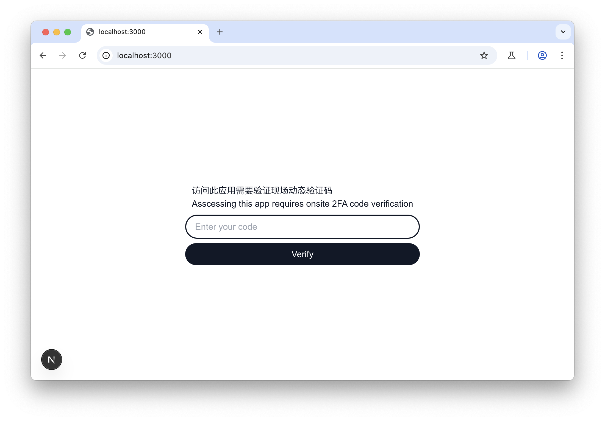

# XJTLU InfoCo's Conway's Game of Life Divination

This is XJTLU InfoCo's Conway's Game of Life Divination project, powered by [Next.js](https://nextjs.org), bootstrapped with [`create-next-app`](https://nextjs.org/docs/app/api-reference/cli/create-next-app).



## Start up

```bash
npm run dev
# or
yarn dev
# or
pnpm dev
# or
bun dev
```
## Configuration

In order to start this project, you need to place a `.env` environment variable file inside the project's root folder.

An example `.env` file: 

```
OPENAI_API_KEY=
OPENAI_BASE_URL=https://api.deepseek.com
OPENAI_MODEL_NAME=deepseek-chat

NEXT_PUBLIC_USE_TWOFA=true
```

### Environment variables definition:

|  Key  | Explanation | Required? |
| :---: | :---------: | :-------: |
| OPENAI_API_KEY | The API key for the app to call with when using openai library to get divination explanations from LLM | YES |
| OPENAI_BASE_URL | The API endpoint for openai library | YES |
OPENAI_MODEL_NAME | Assign the model used for LLM | NO |
| NEXT_PUBLIC_USE_TWOFA | Use 2FA to protect the app from abusing LLM API | NO |


## 2FA Protect

This project was designed for InfoCo's onsite recruitment campaign and as you know, it uses LLM API, which may be abused if not being protected. So 2FA is provided.

If `NEXT_PUBLIC_USE_TWOFA` is set to `true`, the app will enable 2FA protect feature. When Next.js is starting up it will generate a random 2FA secret and output it to terminal in both text and QR code. Please add this 2FA to 2FA apps like `Google Authenticator`.

Whenever a user is accessing the app, they will be prompted to input the 2FA code to use the app. The server will generate a token for then to store in session storage and the expiry time is 10 minutes.

